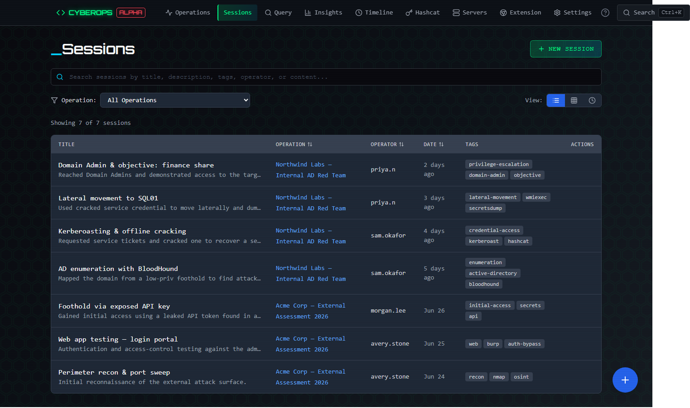
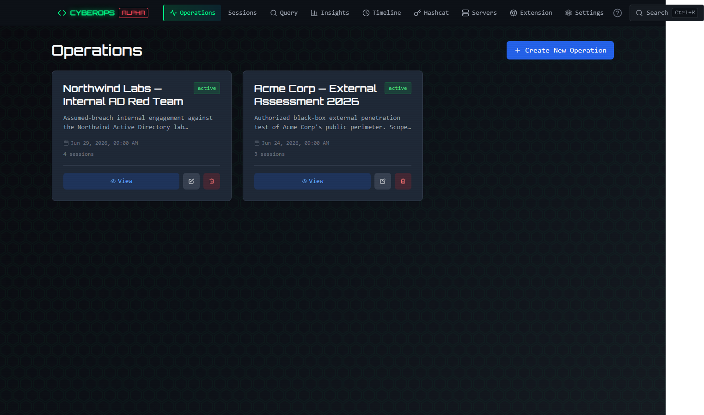
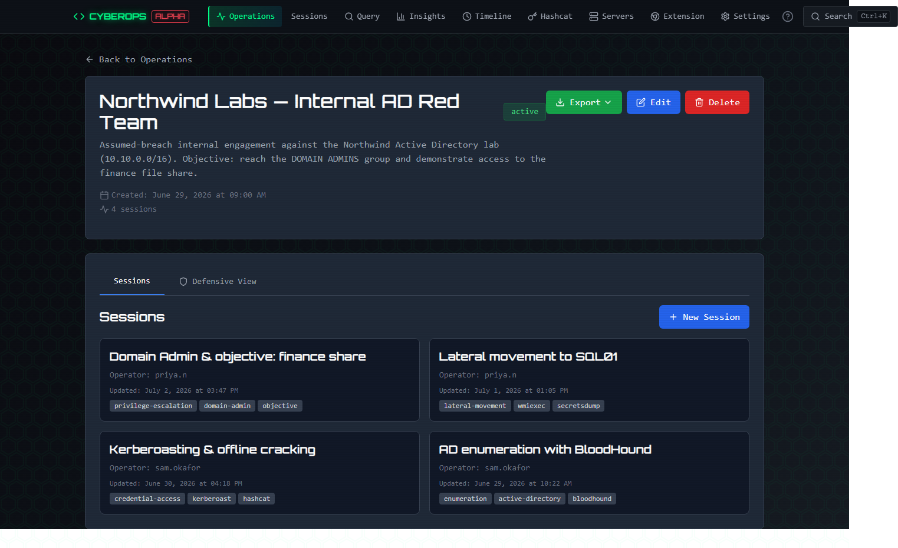
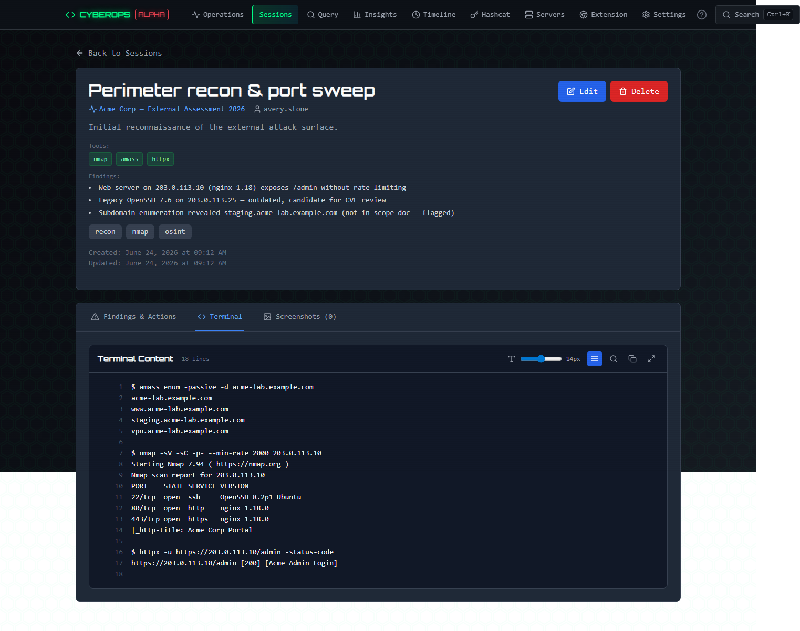
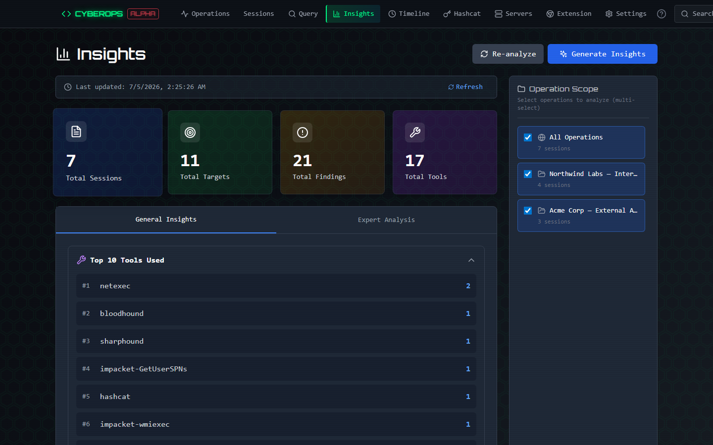
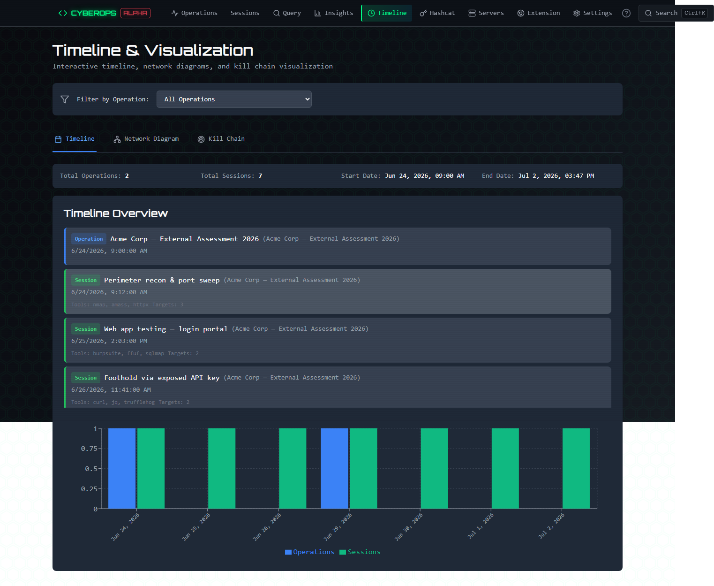
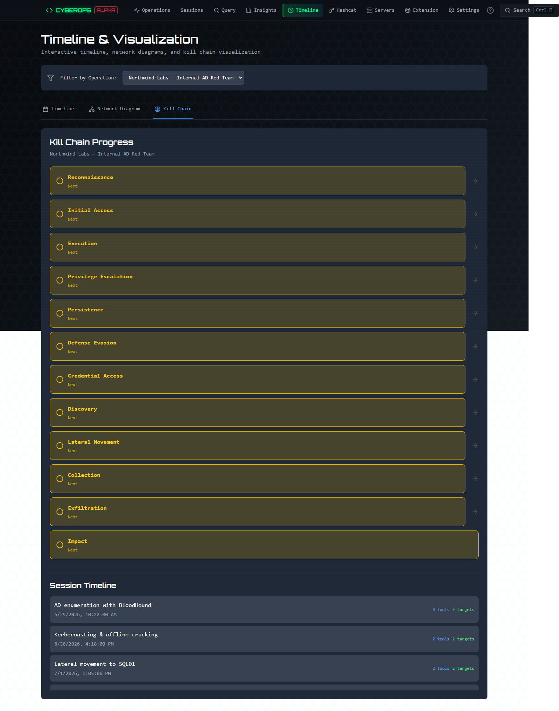
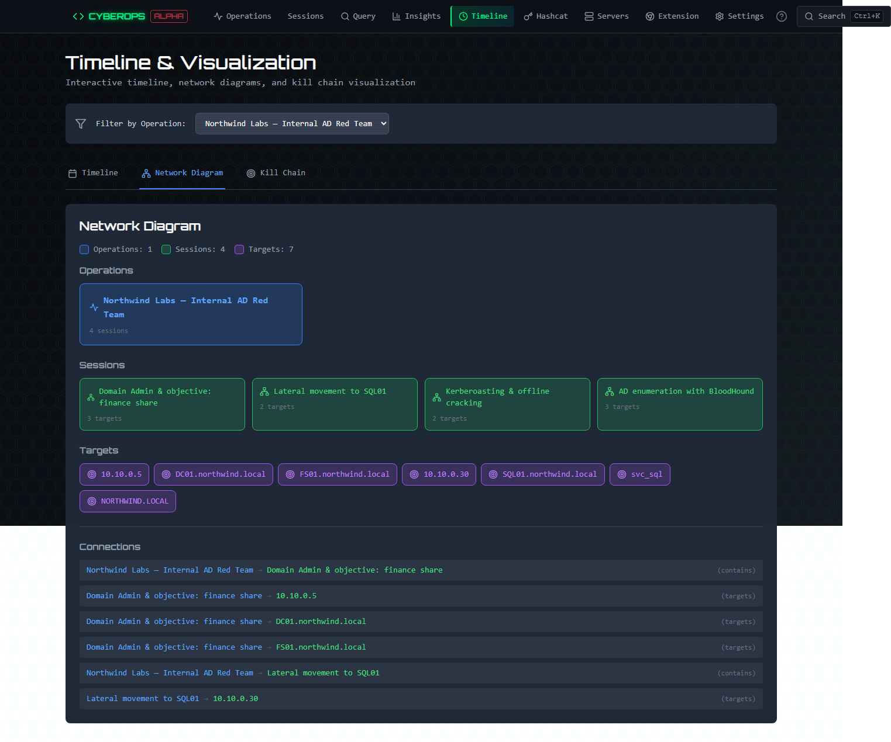
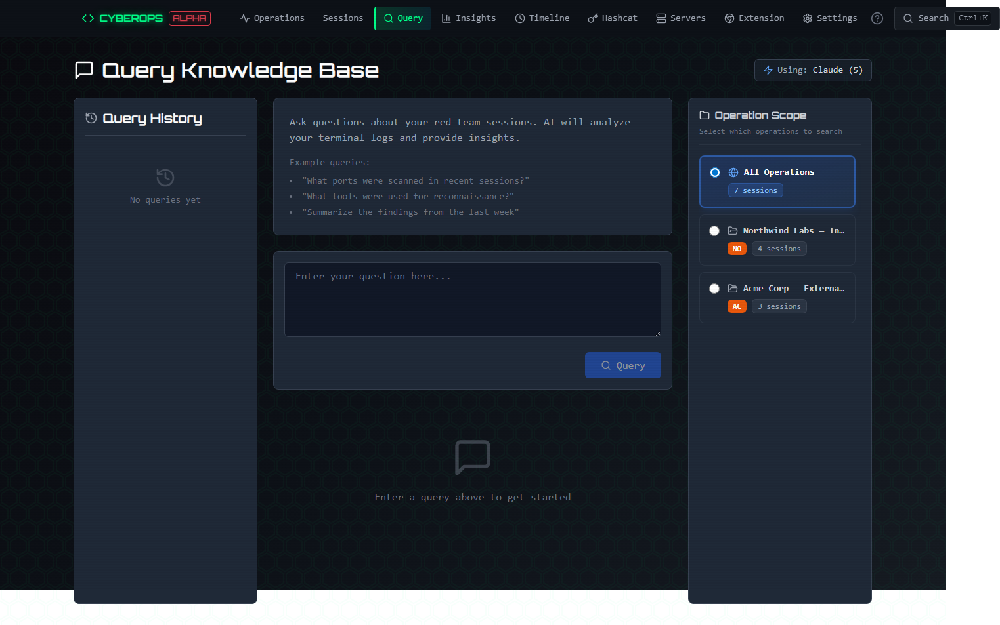

# CyberOps Knowledge Base

A comprehensive knowledge base application for managing cyber operations, sessions, and red team activities.

> **Note:** This repository ships without any operational data. The `data/` and `backend/data/` folders contain empty seed directories (`.gitkeep` only); operations, sessions, screenshots, and reports are created locally at runtime and are git-ignored. Add your own API keys and storage configuration after launch (see Quick Start).

## Features

- **Operations**: Manage and organize cyber operations
- **Sessions**: Record and track terminal sessions with screenshots
- **Query**: AI-powered querying of session data
- **Insights**: Generate expert analysis and statistics
- **Timeline**: Visualize operation timelines and network diagrams
- **Settings**: Configure storage backends and LLM providers

## Screenshots

### Sessions dashboard

Every recorded session in one searchable, filterable table, grouped by operation.



### Operations

Group sessions into engagements and drill into each one.

| Operations list | Operation detail |
| --- | --- |
|  |  |

### Session detail

Full terminal capture with a line-numbered viewer, plus AI-extractable tools, targets, and findings.



### Insights

Aggregate statistics across an engagement: tools used, targets discovered, and a rolled-up findings summary.



### Timeline & visualization

Interactive timeline, MITRE ATT&CK kill-chain progress, and an operation/session/target network diagram.

| Timeline | Kill chain | Network diagram |
| --- | --- | --- |
|  |  |  |

### AI query

Ask natural-language questions across your sessions, scoped to any set of operations.



## Docker and distribution

From the repo root: `docker compose up --build`, then open **http://localhost:8000** - one port serves the built UI and the API. To export a sibling folder without API keys or `settings.json` secrets, run `python scripts/export_bundle.py --force` (default output `../CyberOps-KnowledgeBase`).

## Quick Start

### Backend Setup

```bash
cd backend

# Create virtual environment
python -m venv venv

# Activate virtual environment
# Windows:
venv\Scripts\activate
# macOS/Linux:
source venv/bin/activate

# Install dependencies
pip install -r requirements.txt

# Create .env file with your API key
echo "ANTHROPIC_API_KEY=your-api-key-here" > .env

# Run the backend
uvicorn app.main:app --reload --port 8000
```

### Frontend Setup

```bash
cd frontend

# Install dependencies
npm install

# Run the development server
npm run dev
```

The application will be available at:
- Frontend: http://localhost:5173
- Backend API: http://localhost:8000
- API Docs: http://localhost:8000/docs

## Configuration

### LLM Providers

Configure your preferred LLM provider in Settings:
- **Claude** (Anthropic): Recommended, supports vision
- **OpenAI**: GPT-4 and GPT-4 Turbo
- **Ollama**: Local models

### Storage Backends

Choose your storage backend:
- **JSON**: File-based storage (default)
- **MongoDB**: Document database
- **PostgreSQL**: Relational database

## License

CyberOps Knowledge Base is licensed under the GNU AGPL-3.0. See [LICENSE](LICENSE).


